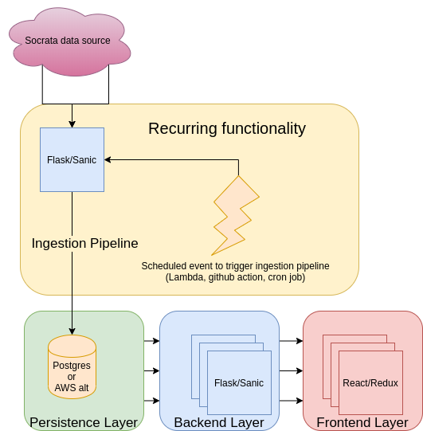

# Engineering Getting Started
Welcome! This readme assumes you have already listened to the 311-data pitch, and gone through the basic onboarding. The following will be more geared towards the programming side of 311-data and getting your development environment setup. If you run into any problems, please submit a new issue.

## Feature Branching
For development we use feature branching to ensure easy collaboration. There aren't any rules to branch naming or how many branches you are allowed to have, but the recommended convention would look like `issueId-Prefix-MinimalDescription`
For example, a documentation branch could look like `138-DOC-OnboardingUpdate`.

Read more about feature branching [here](https://www.atlassian.com/git/tutorials/comparing-workflows/feature-branch-workflow).

## Default Branch
Building on feature branching, we treat the `dev` branch as the main contribution branch. Pull requests to this branch should be as frequent as developers are closing issues *(Hopefully very frequent!)*. Pushes to `master` will be much less frequent and will be handled by administrators. With this workflow, `master` will have an extra layer of protection and should always represent a working version of the application.

In other words, whenever you are about to start on a new feature, checkout your branch based off of the `dev` branch. Your command would look something like `git checkout -b 567-BACK-NewEndpoint dev`. See [this stackoverflow post](https://stackoverflow.com/questions/4470523/create-a-branch-in-git-from-another-branch) for more context.

## Branch Protection/Github Actions
We use [Github Actions](https://github.com/features/actions) to run our continuous integration (CI). These actions include status checks that run whenever you submit a pull request to `dev` or `master`. When you submit a PR, Github will run a set of operations to build and test all or part of the codebase. If any of these steps fail, the pull request will not be allowed to be merged until they are fixed. From the pull request UI you can find the reason an operation may have failed in the status checks section towards the bottom.

If you want to look at our setup, check out the "Actions" tab in Github, as well as the [workflows directory](https://github.com/hackforla/311-data/tree/master/.github/workflows), which contains the code that Github runs when actions are triggered.

In addition to status checks, PR's are required to have at least one reviewer before being merged into `dev` or `master`.

## Testing
CI Is driven by tests, they help instill confidence in pull requests because a developer can say "All the status checks pass and my new tests pass so the PR is safe to merge" When contributing new features, it is most ideal to write at least 4 tests targeting your code.
  - One for the "happy path"
    - Test the endpoint/feature in the way it is intended to be used
  - One for the "extreme path"
    - Test with extreme inputs/characteristics (What if I use 10,000 XYZ)
  - One for the "negative path"
    - Test with strange input, (What if I send characters to a function that expects integers)
  - One for the "null path"
    - Test with empty params/nothing/emptiness

Our front end tests are run through Enzyme and our backend tests are run through Pytest.

## System architecture
Here is our rough draft of our architecture diagram:


## Postgres
Our persistence layer is run by Postgresql. You can review [this](https://www.tutorialspoint.com/postgresql/postgresql_overview.html) if you are unfamiliar.
For local development, we utilize a volatile docker container through docker compose. This is meant for experimentation and working with datasets in isolation.

## Python
Since this project is very data driven, we have targeted python 3 as our backend language. It is utilized in isolation for discovery and exploration. As we get closer to deployment, the exploration work done by the data team will be converted into web server code to enable an interface for the front end to connect to.

## Virtual Environments
Package management in python is handled through our [requirements.txt](https://github.com/hackforla/311-data/blob/master/server/api/requirements.txt). When cloning the repo, this file should allow any python developer to retrieve all the requirements necessary to run the backend. A virtual environment is an organizational structure to isolate your pip dependencies.
It is recommended to review [this](https://www.geeksforgeeks.org/python-virtual-environment/) to get your bearings on virtual environments.
For consistency's sake, it is recommended to create your virtual environment like this: `virtualenv -p python3 ~/.envs/311-data`.
This will create the virtual enviroment in the home folder under `.envs` and it will use python3 as the interpreter.

Running this command does not mean you are _in_ the virtual environment yet. in order to utilize the environment, run `source ~/.envs/311-data/bin/activate` and your terminal should now be prefixed with `(311-data)`.

## Flask/Sanic
For backend work we are using an asynchronous variant of python-flask called Sanic. You can read more about the specific differences [here](https://www.fullstackpython.com/sanic.html).

## React
The front end is written in React/Redux as the application is a reporting dashboard with several visualizations driven by sets of filters. If you are unfamiliar, we recommend starting [here](https://hackernoon.com/getting-started-with-react-redux-1baae4dcb99b).

## API Secrets
We use `.env` files to store secrets and other configuration values. These files are excluded from version control so that secrets are not pushed to our public repository. If you update one of the example `.env` value to include new configuration, be sure not to include secrets when you push to Github.

## Socrata API
We use an api called Socrata to pull 311-related data from `data.lacity.org`. The cool thing about this api is that you can send sql requests, including aggregates. The even cooler thing is that we can ask for a substantial amount of information by using the `$limit` parameter.
An example of this request would look like this:
```
https://data.lacity.org/resource/pvft-t768.csv
?$select=Address,count(*)+AS+CallVolume
&$where=date_extract_m(CreatedDate)+between+1+and+12+and+RequestType=%27Bulky%20Items%27+and+NCName=%27ARLETA%20NC%27
&$group=Address&$order=CallVolume%20DESC
&$limit=50000000
```
